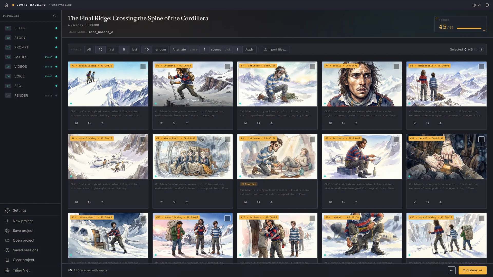
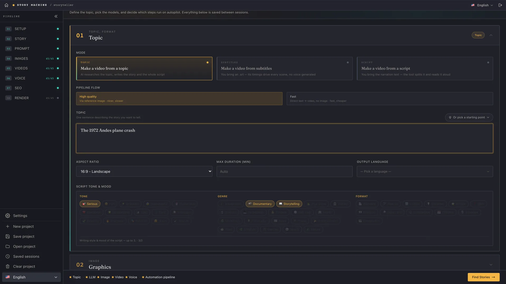
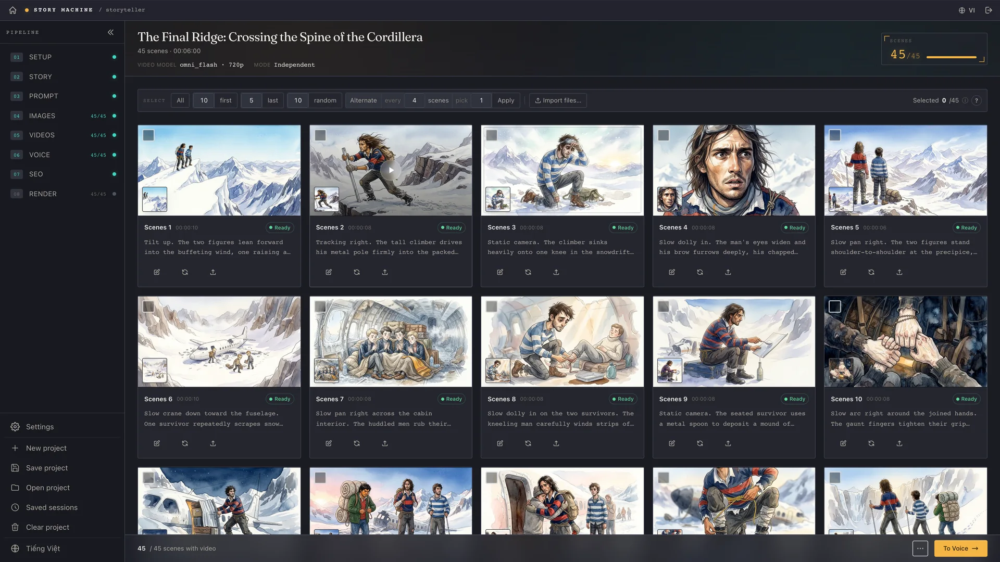
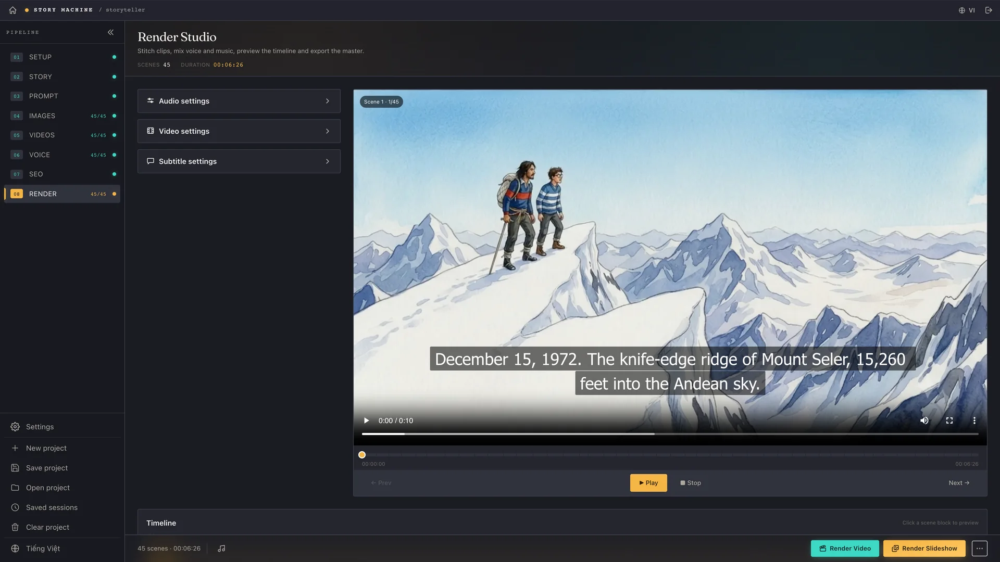

<h1 align="center">G-Labs Story Machine</h1>

<p align="center"><b>A desktop app that turns a topic, a script or a subtitle file into a documentary-style video: the AI writes and plans, G-Labs Studio makes the images and video, and you review every step before the final render.</b></p>

<p align="center">
  <b>English</b> ·
  <a href="README.vi.md">Tiếng Việt</a>
</p>

<p align="center">
  <a href="https://github.com/duckmartians/G-Labs-Story-Machine/releases/latest"></a>&nbsp;
  <a href="https://github.com/duckmartians/G-Labs-Story-Machine/releases/latest"></a>&nbsp;
  <a href="https://github.com/duckmartians/G-Labs-Story-Machine/releases/latest"></a>
</p>

---

## Install

### Step 1 - Pick the right build for your machine

Download the latest build from **[Releases](https://github.com/duckmartians/G-Labs-Story-Machine/releases/latest)**, then choose the file that matches your machine (`<version>` is the release number, e.g. `2.0.6`):

| Your machine | Download | Notes |
|---|---|---|
| 🪟 **Windows 10/11 (64-bit)** | [`StoryMachine-<version>-setup.exe`](https://github.com/duckmartians/G-Labs-Story-Machine/releases/latest) | Installer for any Windows PC |
| 🍎 **Mac with Apple chip (M1/M2/M3/M4)** | [`StoryMachine-<version>-arm64.dmg`](https://github.com/duckmartians/G-Labs-Story-Machine/releases/latest) | macOS 12 or later |
| 🍎 **Mac with Intel chip** | [`StoryMachine-<version>-intel.dmg`](https://github.com/duckmartians/G-Labs-Story-Machine/releases/latest) | Older Macs |

**Not sure which chip your Mac has?** Click the  menu (top-left) → **About This Mac**:
- A **Chip** line reading "Apple M1 / M2 / M3…" → download the **arm64** build.
- A **Processor** line reading "Intel…" → download the **intel** build.

> The **Intel** build still runs on an Apple-chip Mac (through Rosetta, slower), but the **arm64** build will **not open** on an Intel Mac - so pick the right one.

### Step 2 - Install

<details open>
<summary><b>🪟 On Windows</b></summary>

1. Open the downloaded **`StoryMachine-<version>-setup.exe`**.
2. If **"Windows protected your PC"** (SmartScreen) appears: click **More info** → **Run anyway**. *(The app isn't code-signed with a Microsoft certificate, so it's flagged - it isn't a virus.)*
3. Follow the installer - you can keep the default folder or pick another. Desktop and Start Menu shortcuts are created for you.
4. Launch **G-Labs Story Machine** from the **Start Menu** or the **Desktop** shortcut.

</details>

<details open>
<summary><b>🍎 On macOS</b></summary>

1. Open the downloaded **`.dmg`**, then **drag G-Labs Story Machine into the Applications folder**.
2. Go to **Applications**, **right-click** (or Control-click) **G-Labs Story Machine** → **Open** → click **Open** again in the dialog. *(The app isn't signed by Apple, so you must open it this way the **first time**; afterwards it opens normally.)*
3. If macOS says the app is **"damaged / can't be opened"**, or there's no Open button, open **Terminal** and paste:
   ```bash
   xattr -dr com.apple.quarantine "/Applications/G-Labs Story Machine.app"
   ```
   Then open the app again.

</details>

FFmpeg is bundled in both builds - nothing extra to install.

### Step 3 - Sign in (included with the G-Labs MAX plan)

**Story Machine is not sold on its own.** It opens for **your account on an active G-Labs Studio MAX plan**: sign in with Google using that account, and the license server checks your plan every time. A MAX plan bought through G-Labs Studio, Auto Flow or Auto Vibes counts too, since it includes G-Labs Studio Max. If the account isn't on MAX, the app shows **"MAX plan required"** - renew or upgrade, then press **Try again**.

- **Storyteller** is open to every MAX account.
- The **Editor** mode and the **Wildlife documentary** approach are unlocked separately per account. Until then the Editor card shows **"Not open yet"**, and the Wildlife option is not offered.
- The app needs the internet to sign in and receive its prompt set, and must re-check your plan at least every **72 hours**. When the plan expires the app locks; your projects stay on your computer.

The app **updates itself**: it checks GitHub Releases and downloads the new version from inside the app - on Windows it runs the new installer, on macOS it opens the new `.dmg` for you to drag into Applications.

### What else you need

Story Machine orchestrates; it does not generate media by itself. Before your first project, have:

- **An LLM provider** - Claude CLI, Antigravity CLI, Codex CLI (signed in on your computer) or 9Router.
- **[G-Labs Studio](https://github.com/duckmartians/G-Labs-Studio)** running with its Webhook API - for images and video.
- **G-Labs Voiceover** or **G-Labs Voice Studio** - for narration (not needed when you start from an `.srt` file, or if you import your own voiceover).

---

## First run

1. **Open the app and sign in with Google** using your G-Labs MAX account.
2. **Pick a mode** on the start screen - **Storyteller** (narrative/documentary videos) or **Editor** (cut and assemble any video, if unlocked).
3. **Open Settings** (left rail) and connect your tools: choose the LLM provider, then paste the webhook address + API key of G-Labs Studio (images/video) and of Voiceover or Voice Studio (voice).
4. **Set the brief on the Setup page**: choose how to start (topic, script, subtitles or storyboard), then aspect ratio, length, output language, tone and image style.
5. **Walk through the pages** - Story → Analysis → Images → Videos → Voice → SEO → Render. On each page you edit, regenerate or drop in your own files before moving on.
6. **Render** the finished MP4 (video or slideshow), or **Export to CapCut** to finish by hand.

---

## Features



- **Four ways to start** - a **topic** (the AI researches it and writes the story and full narration), your own **script** (split into sentences and voiced), a **subtitle** `.srt` file (its timings drive every scene, no voice generated), or a **storyboard** - a dialogue screenplay with a consistent cast via reference images.
- **Two run modes** - **High quality** (through scene images) and **Fast** (straight text → video, no image step; faster and cheaper).
- **One page per step** - every step of the pipeline is its own page where you review, edit, regenerate or upload your own image/clip before going on.
- **Three ways to picture the story** - with recurring characters, people-free illustrative b-roll, or an animals-only **wildlife documentary** (when unlocked).
- **40+ sample image styles** - or describe your own and save it for later.
- **Translate & copy-edit** - translate or polish a script/subtitle with the LLM before production, with an original ↔ translation toggle.
- **Voiceover, music & render room** - timeline, music ducking under the voice, fade in/out, video-to-voice fitting (freeze last frame, loop or slow down), burned-in subtitles; render a video or a pan/zoom slideshow, or export a CapCut draft.
- **SEO** - title, description, tags and thumbnail ideas for YouTube.
- **Restore points** - go back to an earlier state of a project; restoring first saves a new point, so it can be undone too.
- **11 interface languages** - English, Tiếng Việt, हिन्दी, Türkçe, Português, 简体中文, اردو, বাংলা, Русский, Español, ไทย.

---

## Modes &amp; pages

The start screen offers two modes. Both stay open once visited, so switching never loses work; the Home button returns to the picker.

### 🎬 Storyteller - Setup



Pick how to start - **Make a video from a topic**, **from a script**, **from subtitles** or **from a storyboard** - and the run mode (**High quality** or **Fast**). Then set aspect ratio, length, output language, tone and image style. The pages that follow depend on how you started:

| Start from | Pages |
|---|---|
| Topic | Setup → Story → Analysis → Images → Videos → Voice → SEO → Render |
| Script | Setup → Voice → Analysis → Images → Videos → SEO → Render |
| Subtitles (`.srt`) | Setup → Analysis → Images → Videos → SEO → Render |
| Storyboard | Setup → Script → Components → Shot plan → Images → Videos → SEO → Render |

### 🖼 Analysis &amp; Images


The LLM breaks the story into scenes, each with its own duration and prompt; images are generated through the G-Labs Studio webhook. Per scene you can edit the prompt, regenerate, or upload your own image.

### 🎥 Videos



Turn scene images into clips with G-Labs Studio's video models, each scene with its own motion prompt. Quick-select all, the first/last few, random or every Nth scene to animate only some of them - the rest still render as stills.

### 🎞 Voice, SEO &amp; Render



Narration comes from G-Labs Voiceover or Voice Studio, or import a ready-made voiceover file. The **SEO** page suggests a title, description, tags and thumbnail ideas. The **Render** room has a timeline, music ducking, fades, video-to-voice fitting and burned-in subtitles; hit **Render Video**, **Render Slideshow** with pan/zoom effects, or **Export to CapCut**.

### 🧩 Storyboard (inside Storyteller)

Start from a dialogue screenplay: the app extracts characters, locations and props, draws reference images for them (**Components**), breaks the script into shots (**Shot plan**), then generates consistent per-shot images and videos.

### ✂️ Editor *(separately unlocked)*

Cut and assemble any video: bulk drag-in, trim, split and reorder on a waveform timeline. Auto-fit clips to subtitle cues, detected silence or a BPM grid; music ducks under narration; pan/zoom for stills; styled burn-in subtitles; queued rendering.

---

## Where your data lives

| What | macOS | Windows |
|---|---|---|
| Projects, images, videos, renders | `~/Documents/G-Labs Story Machine/output` | `%USERPROFILE%\Documents\G-Labs Story Machine\output` |
| Settings, keys (`.env`, `settings.json`), sign-in session | `~/Library/Application Support/G-Labs Story Machine` | `%APPDATA%\G-Labs Story Machine` |

You can move the output folder in **Settings → Output folder**. Story content is sent to the LLM provider you choose; the license server is only used to sign in, check your plan and deliver the prompt set.

---

## Troubleshooting

**"MAX plan required" after signing in** - the account isn't on an active MAX plan. Renew or upgrade, then press **Try again** (it re-checks with the server).

**The Editor card says "Not open yet" / no Wildlife option** - these are unlocked separately per account; your account doesn't have them yet.

**"Server not responding - check that the webhook is running"** - start G-Labs Studio (and Voiceover / Voice Studio for voice) and turn on its webhook, then check the address in Settings.

**"The webhook rejected the API key"** - copy the API key again from G-Labs Studio's Webhook API page into Settings.

**A scene says the webhook no longer has the task** - the webhook restarted or the task expired; click **Regenerate** on that scene.

**Windows blocks it at "Windows protected your PC"** - click **More info → Run anyway**. The app isn't code-signed with a Microsoft certificate, so it's flagged - it isn't a virus.

**macOS says the app is damaged / can't be opened** - it isn't signed by Apple. Right-click → **Open** the first time, or run `xattr -dr com.apple.quarantine "/Applications/G-Labs Story Machine.app"`.

**An update won't install** - download the latest build manually from [Releases](https://github.com/duckmartians/G-Labs-Story-Machine/releases/latest).
