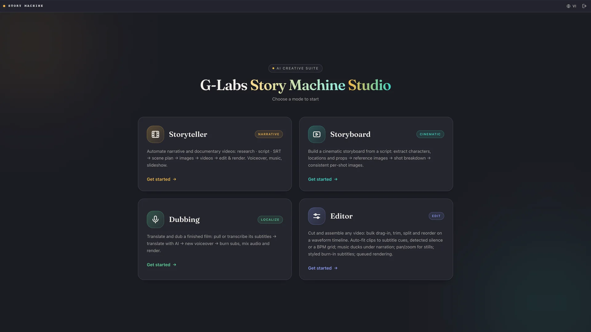

<p align="center">
  
</p>

<h1 align="center">Story Machine</h1>

<p align="center"><strong>English</strong> · <a href="README.vi.md">Tiếng Việt</a></p>

Story Machine is a desktop app that turns an idea, a script, or a subtitle file into a finished documentary-style video — automatically.

Give it a topic and it researches the story, writes the narration, plans every scene, generates the images and video clips, adds an AI voice-over and background music, and renders the final video. Already have a script or an `.srt` file? Feed it in and Story Machine builds the visuals around your own words, with per-scene timing locked to the narration.

<p align="center">
  
</p>

## Highlights

- **Three input modes** — start from a topic (AI research), your own script, or a subtitle (`.srt`) file
- **Full pipeline in one app** — analysis → scene planning → image generation → video generation → voice-over → SEO metadata → final render
- **Wildlife documentary mode** — a dedicated storytelling engine for nature films (cold-open hooks, suspense pacing, zoological accuracy)
- **Translation & copy-editing** — translate or polish a script/subtitle before production, with an original ↔ translated toggle
- **Quality & Fast run modes**, thumbnail concepts, SEO titles/description/tags
- **Story Board mode** for illustrated stories
- **11 UI languages** (English, Tiếng Việt, हिन्दी, Türkçe, Português, 中文, اردو, বাংলা, Русский, Español, ไทย)

An account and an internet connection are required — sign in on first launch. An LLM provider is configured in Settings after login.

## A look inside

The whole pipeline lives in one window — each step is its own page you can review and fix by hand before moving on. Screenshots below are from a real project, *The Final Ridge*.

| Set up the project | Generate the images |
| --- | --- |
|  |  |
| **Generate the videos** | **Render the final film** |
|  |  |

## Install on macOS

> Requires an Apple Silicon Mac (M1 or newer), macOS 12+.

1. Download `StoryMachine-<version>-arm64.dmg` from the [Releases](../../releases) page.
2. Open the DMG and drag **Story Machine** into **Applications**.
3. The app is not notarized yet, so the first launch is blocked by Gatekeeper. Either:
   - **Right-click** the app → **Open** → **Open**, or
   - run in Terminal:

```bash
xattr -dr com.apple.quarantine "/Applications/Story Machine.app"
```

4. Launch the app and sign in.

## Install on Windows

> Requires Windows 10/11, 64-bit.

1. Download `StoryMachine-<version>-setup.exe` from the [Releases](../../releases) page.
2. Run the installer. If Windows SmartScreen appears, click **More info** → **Run anyway**.
3. Pick an install folder (or keep the default). Desktop and Start Menu shortcuts are created automatically.
4. Launch **Story Machine** and sign in.

## Notes

- FFmpeg is bundled — no extra installation needed on either platform.
- Generated projects, images, videos and renders are stored locally on your machine.
