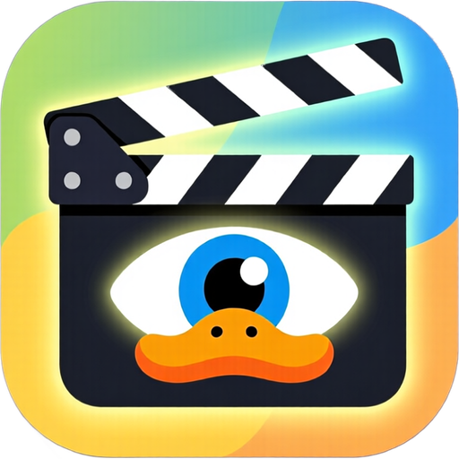
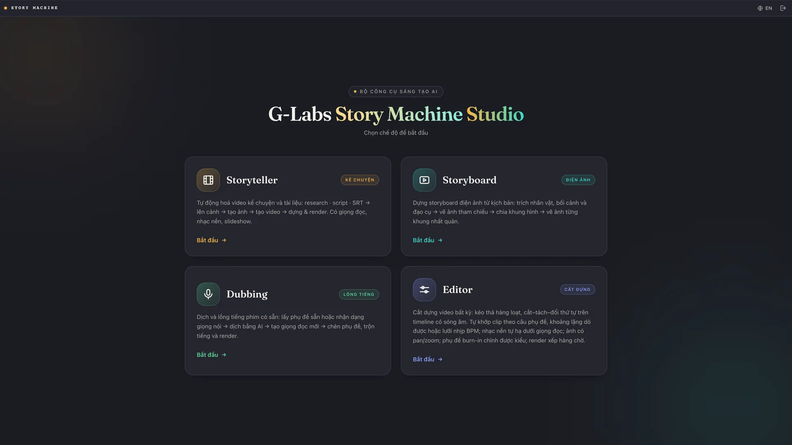
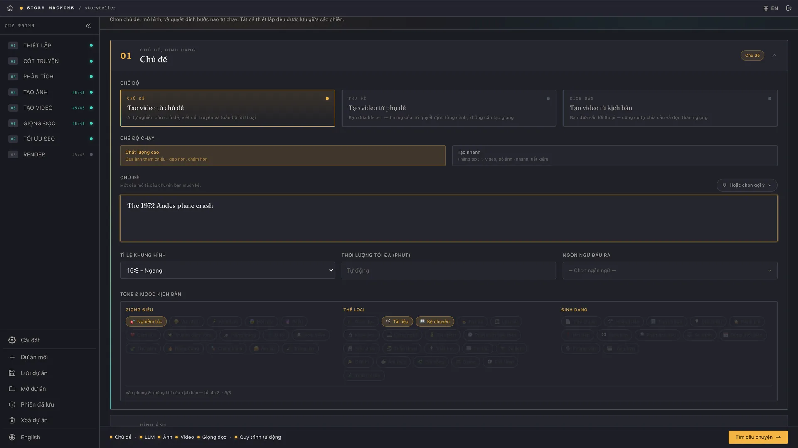
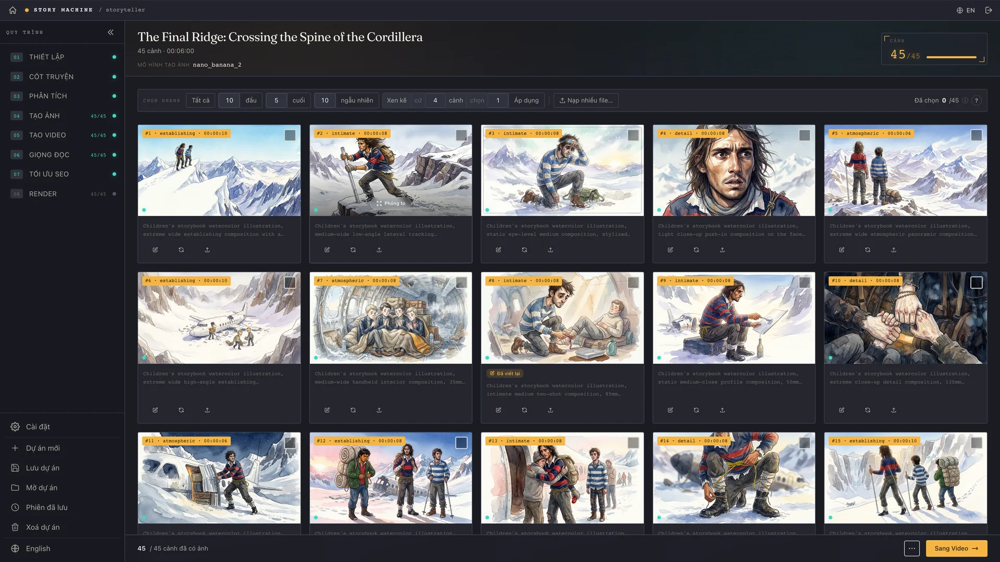
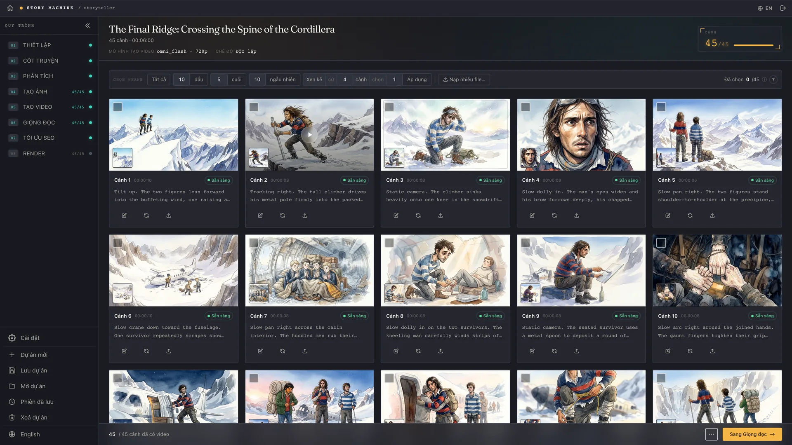
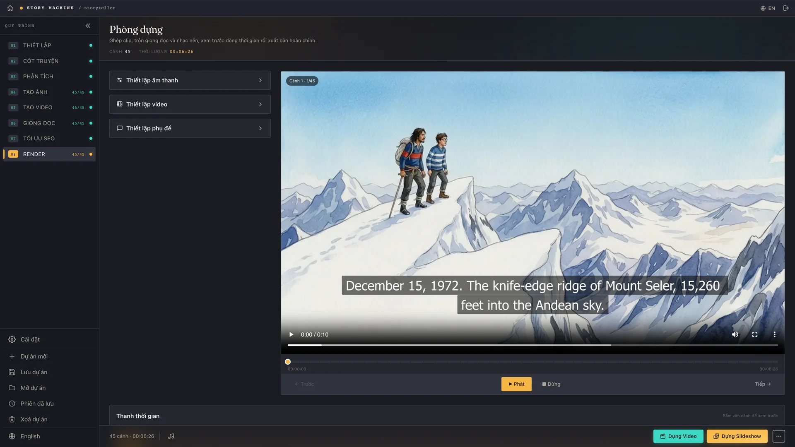

<p align="center">
  
</p>

<h1 align="center">Story Machine</h1>

<p align="center"><a href="README.md">English</a> · <strong>Tiếng Việt</strong></p>

<p align="center">
  <a href="https://github.com/duckmartians/G-Labs-Story-Machine/releases/latest"></a>
  &nbsp;
  <a href="https://github.com/duckmartians/G-Labs-Story-Machine/releases/latest"></a>
</p>

Story Machine là ứng dụng desktop biến một ý tưởng, một kịch bản, hoặc một file phụ đề thành video phong cách phim tài liệu hoàn chỉnh — hoàn toàn tự động.

Chỉ cần đưa một chủ đề, app sẽ tự nghiên cứu câu chuyện, viết lời bình, lên kế hoạch từng cảnh, tạo ảnh và video, thêm giọng đọc AI cùng nhạc nền, rồi render ra video cuối cùng. Đã có sẵn kịch bản hoặc file `.srt`? Nạp vào và Story Machine dựng hình ảnh bám theo đúng lời của bạn, thời lượng từng cảnh khoá chính xác theo lời đọc.

<p align="center">
  
</p>

## Điểm nổi bật

- **Ba chế độ đầu vào** — bắt đầu từ chủ đề (AI tự nghiên cứu), kịch bản của bạn, hoặc file phụ đề (`.srt`)
- **Trọn quy trình trong một app** — phân tích → lên cảnh → tạo ảnh → tạo video → giọng đọc → SEO → render
- **Chế độ phim tài liệu động vật hoang dã** — bộ máy kể chuyện riêng cho phim thiên nhiên (mở màn cold-open, nhịp hồi hộp, chính xác về sinh học)
- **Dịch & biên tập** — dịch hoặc trau chuốt kịch bản/phụ đề trước khi sản xuất, chuyển qua lại bản gốc ↔ bản dịch
- **Hai chế độ chạy Chất lượng & Nhanh**, ý tưởng thumbnail, tiêu đề/mô tả/tag SEO
- **Chế độ Story Board** cho truyện minh hoạ
- **11 ngôn ngữ giao diện** (English, Tiếng Việt, हिन्दी, Türkçe, Português, 中文, اردو, বাংলা, Русский, Español, ไทย)

Cần tài khoản và kết nối internet — đăng nhập ở lần mở đầu tiên. Nhà cung cấp LLM cấu hình trong phần Cài đặt sau khi đăng nhập.

## Nhìn vào bên trong

Toàn bộ quy trình nằm gọn trong một cửa sổ — mỗi bước là một trang riêng, bạn xem lại và chỉnh tay trước khi đi tiếp. Ảnh dưới đây từ một dự án thật, *The Final Ridge*.

| Đặt đề bài | Tạo ảnh |
| --- | --- |
|  |  |
| **Tạo video** | **Render phim hoàn chỉnh** |
|  |  |

## Cài đặt trên macOS

> Yêu cầu Mac chip Apple Silicon (M1 trở lên), macOS 12+.

1. Tải `StoryMachine-<version>-arm64.dmg` ở trang [Releases](../../releases).
2. Mở file DMG và kéo **G-Labs Story Machine** vào **Applications**.
3. App chưa notarize nên lần mở đầu sẽ bị Gatekeeper chặn. Chọn một trong hai cách:
   - **Chuột phải** vào app → **Open** → **Open**, hoặc
   - chạy trong Terminal:

```bash
xattr -dr com.apple.quarantine "/Applications/G-Labs Story Machine.app"
```

4. Mở app và đăng nhập.

## Cài đặt trên Windows

> Yêu cầu Windows 10/11, 64-bit.

1. Tải `StoryMachine-<version>-setup.exe` ở trang [Releases](../../releases).
2. Chạy file cài đặt. Nếu Windows SmartScreen hiện cảnh báo, bấm **More info** → **Run anyway**.
3. Chọn thư mục cài (hoặc để mặc định). Shortcut ngoài Desktop và Start Menu được tạo tự động.
4. Mở **G-Labs Story Machine** và đăng nhập.

## Ghi chú

- FFmpeg đã đóng gói sẵn — không cần cài thêm gì trên cả hai hệ điều hành.
- Dự án, ảnh, video và bản render được lưu ngay trên máy của bạn.
